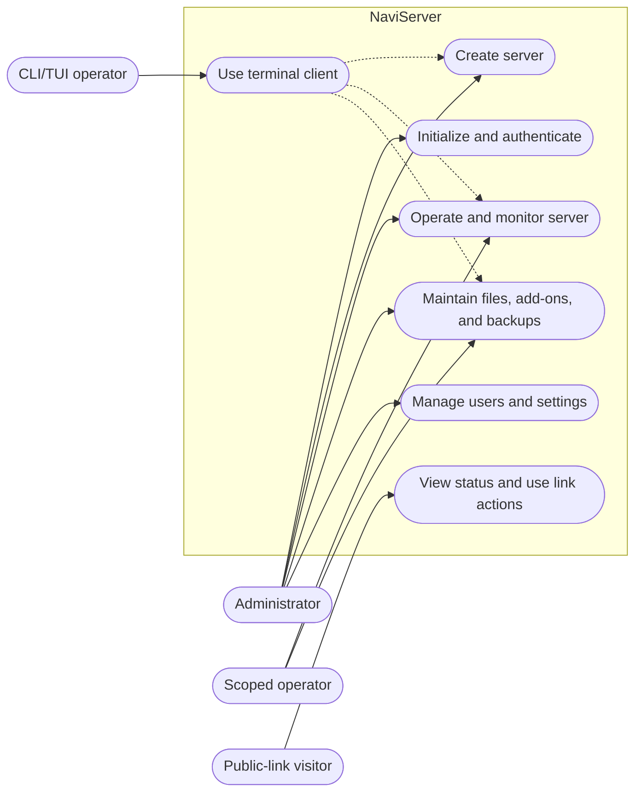
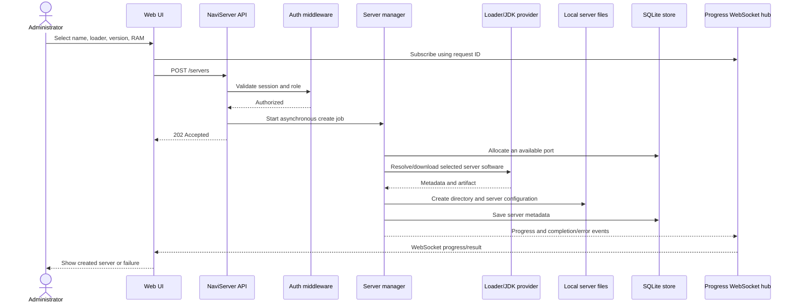

# Functionality

## Purpose and status

This page captures **current behavior and explicitly labeled owner-approved targets**, derived from the README, wiki, changelog, routes, handlers, UI, and tests. It is not a backlog. The owner confirmed personal/small self-hosted use, on trusted LAN/VPN networks. Feature priorities and numeric quality targets remain unspecified. The owner approved explicit EULA acceptance as a target change; it is not implemented.

Priority scale for later product decisions: `P0` = essential for the first safe usable outcome; `P1` = important follow-up; `P2` = optional evolution. No priorities are assigned yet (`TBD`). `Observed current` means the behavior exists in the inspected implementation; it does not itself mean a new future commitment was accepted.

## Source capability inventory

| Source | Capability | Disposition | Requirement mapping |
|---|---|---|---|
| [README: What NaviServer does](../../README.md#what-naviserver-does) | Instance creation, loaders/JVM, lifecycle/monitoring, console, files, add-ons, backups, users, links. | Current documented capability; code paths inspected. | RF-002–RF-009 |
| [README: administration options](../../README.md#cli-administration), [CLI](../../wiki/cli.md), [TUI](../../wiki/tui.md) | Web, CLI, TUI administration. | Current clients use the daemon API. Owner intends TUI discontinuation; not removed, no deadline. CLI remains in scope. | RF-010 |
| [Configuration guide](../../wiki/configuration.md) | Paths, API binding, origins, secrets, CLI authentication. | Current documented configuration. | RF-001, RF-007, RNF-001 |
| [Installation guide](../../wiki/installation.md), [migration guide](../../wiki/migration-from-1x.md) | Native/Docker install, upgrades, migration, uninstall. | Current documented operations. | RNF-003, RNF-004 |
| [Changelog](../../CHANGELOG.md) | Chunked uploads, automatic backups, add-on preview/dependencies, per-server Java selection, security hardening. | Current history; relevant behavior rechecked in code where used below. | RF-004–RF-008, RNF-001 |
| Product owner clarification (2026-10-04) | Maintainer/developer audience, personal/small self-hosted use on LAN/VPN; opt-in public control, console power permission, backup restore paths, explicit first-start EULA consent; TUI retirement intent and development convention; no plan. | Confirmed context and policies; EULA is an accepted target, not implemented. | RF-005, RF-007, RF-009, RF-011, RN-002, RN-003, RN-005, RNF-005 |

## Actors and capabilities

| ID | Actor | Capability and observable outcome | Requirements |
|---|---|---|---|
| CU-001 | Administrator | Initialize access, then create a server and receive progress and completion/failure. | RF-001, RF-002 |
| CU-002 | Administrator or permitted operator | Operate and monitor assigned Minecraft instances, including live console output. | RF-003, RF-007 |
| CU-003 | Administrator or permitted operator | Manage files, uploads, add-ons, and backups according to server access. | RF-004, RF-005, RF-006, RF-007 |
| CU-004 | Administrator | Manage users, server permissions, and application/server settings. | RF-007, RF-008 |
| CU-005 | Public-link visitor | View server status/player summary and use the current link's start/stop actions. | RF-009 |
| CU-007 | Authorized starter | Explicitly accept EULA before first launch of a new server with `eula=false` (accepted target, pending implementation). | RF-011 |
| CU-006 | CLI/TUI operator | Perform supported administration via the daemon API from a terminal or script. | RF-010 |

The TUI remains implemented but is intended for discontinuation by owner decision (2026-10-04); no removal version/date is assigned. RF-010 records current clients, not a future TUI support commitment. CLI is not discontinued.

## User stories

| ID | Story | Requirements |
|---|---|---|
| HU-001 | As the first administrator, I want to initialize an account and sign in so I can secure and operate a fresh installation. | RF-001 |
| HU-002 | As an administrator, I want to provision a server with a selected loader/version and resources so it is ready to configure and run. | RF-002, RF-008 |
| HU-003 | As an authorized operator, I want to start, stop, inspect, and follow server output so I can run assigned instances. | RF-003, RF-007 |
| HU-004 | As an authorized operator, I want to edit and transfer server files so I can maintain a server installation. | RF-004, RF-007 |
| HU-005 | As an authorized operator, I want to create and restore backups so I can recover a Minecraft instance. | RF-005, RF-007 |
| HU-006 | As an authorized operator, I want to find, install, update, disable, and remove add-ons so I can maintain a modded server. | RF-006, RF-007 |
| HU-007 | As an administrator, I want to manage users, permissions, Java choices, and system settings so access and runtime behavior match my installation. | RF-007, RF-008 |
| HU-008 | As a server owner, I want to share a public link so visitors can inspect the server and use the currently available controls. | RF-009 |
| HU-009 | As a terminal user, I want CLI/TUI access to the daemon so I can automate or administer it without the browser. | RF-010 |
| HU-010 | As an authorized starter, I want to explicitly accept EULA when a new server has `eula=false`, so server creation does not silently accept it for me. | RF-011 |

## Functional requirements

The register separates source-derived current behavior from owner-approved policy and the explicitly labeled EULA target. Acceptance criteria describe observable behavior; the owner has not ranked them.

| ID | Requirement | Origin / decision status | Priority | Acceptance criteria and verification |
|---|---|---|---|---|
| RF-001 | The system shall allow the first account to be created as administrator only while no user exists, then support authenticated login/logout. | `auth.go`; `auth_test.go`. Observed current. | TBD | Empty user store permits setup and yields authenticated session; later setup is rejected; invalid credentials do not authenticate. Automated: TC-001. |
| RF-002 | The system shall create a named server for a supported loader/version and RAM setting, allocate a port, create its local files, persist its metadata, and report asynchronous progress/result. | `server.go`, `server/manager.go`, loader factory, `CreateModal.tsx`, `ServerContext.tsx`. Observed current. | TBD | Create request is accepted; progress is delivered to the request channel; success yields a persisted server and directory; failure is reported and failed partial files are cleaned where implemented. Manual: TC-002. |
| RF-003 | The system shall let an authorized operator start, stop, restart, and kill an instance, inspect its status/resources/players, and follow or send console commands. | `server.go`, `runner/supervisor.go`, WebSocket handlers and server-detail UI. Observed current. | TBD | Authorized operations return their result; live state/output is shown; deletion is rejected unless the server is stopped. Automated plus manual: TC-003. |
| RF-004 | The system shall let authorized operators list, read, edit, create, delete, upload, and download files in a server directory. | `handlers/files.go`, `internal/upload`, file explorer/editor and upload UI. Observed current. | TBD | File operations stay within the selected server path and enforce permissions; chunked uploads expose progress and support the implemented retry/cancel flow. Automated plus manual: TC-004. |
| RF-005 | The system shall create, list, download, restore, upload, and delete server backups, and support configurable automatic backups and retention. | `internal/backup`, backup handlers, backup UI. Observed current. | TBD | Automatic backups run when enabled and use configured settings; a selected backup can be restored into an existing instance or a newly created instance; configured retention is applied. Owner confirmed these paths. Automated plus restore smoke: TC-005. |
| RF-006 | The system shall search supported add-on sources and support preview, install, update, disable, synchronization, and removal for a server. | `internal/addons`, add-on handlers and `AddonsPanel.tsx`. Observed current. | TBD | Search/install uses the selected source; preview identifies required dependencies; install/update and disable/remove actions have visible outcomes. Automated plus provider smoke: TC-006. |
| RF-007 | The system shall allow permitted operators to administer eligible server features while restricting administrator-only operations to administrators. | `router.go`, `middleware.go`, handler permission checks, user UI. Observed current; owner confirms console permission includes start/stop control. | TBD | Admin-only endpoints reject non-admin identities; a non-admin can access only servers/features allowed by stored permissions. Automated plus manual: TC-007. |
| RF-008 | The system shall expose global and per-server settings, including network/log settings, server properties, Java selection, and supported version updates. | Settings handlers, `internal/server/settings.go`, configuration guide. Observed current. | TBD | Read/update requests persist valid settings; invalid values are rejected; supported Java/version choices are surfaced. Automated plus manual: TC-008. |
| RF-009 | Public links shall be disabled by default and enabled explicitly by an admin or a user with console permission on that server; anyone holding an enabled link can inspect on/off status and start/stop the server. | `handlers/links.go`, `PublicServer.tsx`. Owner-approved policy (2026-10-04); control actions observed. Admin/console role is owner-confirmed and matches handler checks; default state requires runtime verification. | TBD | Before activation, no usable link exists; after activation, a valid token shows status and permits start/stop without account login; revocation/invalid tokens reject access. Existing summary also includes version/loader and player counts. Manual: TC-009. |
| RF-010 | The system shall expose supported administration through the browser UI and `naviserver-cli`; interactive TUI is recorded as a current client intended for discontinuation. | `web/src/App.tsx`, `cmd/cli`, `internal/cli`, `pkg/sdk`; README/wiki. Observed current. | TBD | The client calls the configured daemon API; CLI authentication uses its configured token; core operations work without direct database access. Manual: TC-010. |
| RF-011 | On a start attempt for a newly created server with `eula=false`, the browser shall show an explicit EULA acceptance modal and block process launch until acceptance. | Owner-approved target (2026-10-04). NOT IMPLEMENTED: creation currently writes `eula=true`. | TBD | Creation does not implicitly accept EULA; false triggers the modal; cancel leaves the server stopped/unaccepted; explicit acceptance permits start; already accepted does not prompt. Admins and server-console users may accept. Public-link and CLI starts report acceptance required and stop; TUI offers explicit acceptance while supported. No caller may bypass the gate. Target verification: TC-014. |

## Non-functional requirements and quality targets

This register distinguishes implemented controls from owner-approved quality targets. No numeric priorities or service-level objectives have been set.

| ID | Quality requirement/scenario | Source and status | Target / priority | Verification |
|---|---|---|---|---|
| RNF-001 | Protected operations shall reject missing/invalid authentication and enforce administrator or server-specific authorization. | Middleware/routes/tests: observed current. | Target behavior is testable; WebSocket per-server/job enforcement needs review (see contracts). Supported access is trusted LAN/VPN, with opt-in bearer control links. A broader deployment threat model is not specified. Priority TBD. | TC-001, TC-007; `internal/api/security_test.go`, auth and handler tests. |
| RNF-002 | Server metadata, settings, users, and backup metadata shall persist in the configured SQLite database; server/runtime/backup files shall use configured local paths. | `config.go`, `storage/gorm.go`, Docker volume docs: observed current. | Persistence is implemented; durability/restore objective is TBD. Priority TBD. | TC-011; configuration review and manual restart/restore check. |
| RNF-003 | The published distributions shall match the documented native and container platform support. | README, `build.sh`, `build.bat`, release workflow, Dockerfile: documented/observed build targets. | Native Windows/macOS/Linux; Docker `linux/amd64` and `linux/arm64`. Actual artifacts were not built in this review. Priority TBD. | TC-012; release CI matrix. |
| RNF-004 | NaviServer shall provide an agreed level of availability, capacity, and recovery for its self-hosted use. | No product target or operational measurement found. Pending owner decision. | TBD: instance/player capacity, availability expectation, RPO/RTO, and backup retention for all application data. | Define targets before claiming compliance; manual load/recovery tests when targets exist. |
| RNF-005 | Remote access shall use an agreed transport and proxy-trust configuration. | App serves HTTP; secure cookie behavior and `NAVISERVER_TRUST_PROXY` are documented/observed. | Owner-approved scope is trusted LAN/VPN access, not direct Internet exposure. Local HTTP is supported; VPN/network trust does not replace authentication. No new mandatory TLS policy was specified. Priority TBD. | TC-013; deployment review against owner-approved policy. |

## Domain rules and security-sensitive behavior

| ID | Current rule or explicitly labeled accepted target | Source | Related requirements | Verification / decision |
|---|---|---|---|---|
| RN-001 | The first user created through setup receives the `admin` role; setup is blocked after at least one user exists. | [`auth.go`](../../internal/api/handlers/auth.go) | RF-001, RF-007 | TC-001. |
| RN-002 | When permissions are saved, `CanViewConsole` forces `CanControlPower`; start/stop/restart/kill checks accept either flag. | [`users.go`](../../internal/api/handlers/users.go), [`server.go`](../../internal/api/handlers/server.go) | RF-003, RF-007 | Owner confirms console access intentionally includes start/stop. Current restart/kill checks also accept either flag; that broader implementation is recorded, not separately approved. |
| RN-003 | A generated public link currently has action `control`; its bearer token enables unauthenticated status lookup and start/stop commands. | [`links.go`](../../internal/api/handlers/links.go) | RF-009, RNF-001 | Owner approves start/stop through opt-in links, disabled by default. Verify the enable/revoke boundary in TC-009. |
| RN-004 | A server must be stopped before deletion; the handler returns conflict otherwise. | [`server.go`](../../internal/api/handlers/server.go), [`server_delete_test.go`](../../internal/api/handlers/server_delete_test.go) | RF-003 | TC-003. |
| RN-005 | Accepted target: when a new server is started with `eula=false`, require explicit EULA acceptance before launching; do not prompt when already accepted. | Owner decision (2026-10-04); current [`manager.go`](../../internal/server/manager.go) instead writes `eula=true`. | RF-002, RF-011 | TC-014; implementation gap, not verified functionality. |
| RN-006 | The CLI auth token is treated as an administrator identity by API middleware. | [`middleware.go`](../../internal/api/middleware.go), [`configuration.md`](../../wiki/configuration.md) | RF-007, RF-010, RNF-001 | Protect this secret as an admin credential; test/review token handling. |

## Use-case view

**Current-state view** based on routes and UI. Public-link visitors are a distinct unauthenticated actor; opt-in status and start/stop control are owner-approved policy. This current-state diagram does not depict the pending EULA gate.

The CLI/TUI is a separate client, not a second data owner. It invokes capabilities through the daemon's API and WebSocket routes.

## Detailed use cases

### CU-001 — Create a server

- **Actor:** Administrator using the Web UI; CLI/TUI use the same API with their documented interaction modes.
- **Requirements:** RF-001, RF-002, RF-008, RF-010.
- **Preconditions:** Daemon is available; the caller is authorized; the selected loader/version is supported; local disk and an available server port exist.
- **Main flow:**
  1. The administrator selects a server name, loader, version/build options, and RAM.
  2. The UI creates a request ID and begins listening to its progress WebSocket before submitting the request.
  3. The API authenticates the caller, starts the asynchronous creation job, and returns `202 Accepted`.
  4. The manager allocates a port, loads the selected server software, creates/configures the server directory, writes `eula=true`, and stores server metadata.
  5. Progress and a success result are streamed to the client; the new server becomes available in the dashboard.
- **Alternatives/failures:** Invalid server name, unsupported loader/version, port allocation failure, provider/download failure, or persistence failure. Errors are reported through the progress stream; partial files are removed for loader or database failures where the manager implements cleanup. A network interruption can lose live progress; no durable job queue is documented.
- **Result:** A stopped instance with a persisted record, selected loader/version/RAM, assigned port, and local files—or a reported creation failure.
- **Evidence:** [`CreateModal.tsx`](../../web/src/components/dashboard/CreateModal.tsx), [`ServerContext.tsx`](../../web/src/context/ServerContext.tsx), [`handlers/server.go`](../../internal/api/handlers/server.go), [`internal/server/manager.go`](../../internal/server/manager.go), and [`internal/loader/factory.go`](../../internal/loader/factory.go).

### CU-005 — Use a public server link

- **Actor:** Anyone possessing a valid link token.
- **Requirements:** RF-009, RN-003, RNF-001.
- **Precondition:** The server administrator explicitly enabled the server's link; links are disabled by default under the approved policy. Admins and scoped console users may enable/revoke it under the confirmed policy.
- **Current flow:** The visitor opens the link; the UI fetches a server summary; while the server is running, the page refreshes status/player information; the visitor may send start or stop through the current `control` action.
- **Risk/decision:** Possession of the token is sufficient for the public action; there is no separate visitor login in this flow. The owner approves this access level once a link is enabled. Network access is still limited to the intended LAN/VPN deployment.

### CU-007 — Explicit EULA acceptance on first start (accepted target)

- **Actor:** Admin or user with console permission on that server, using the browser or current TUI.
- **Requirements:** RF-011, RN-005; relates to RF-003 and RF-009 start paths.
- **Precondition:** Newly created server is stopped and its EULA value is false.
- **Target flow:** Start attempt checks EULA; the UI shows an explicit acceptance modal; cancellation leaves it stopped; acceptance records the accepted state before process launch. With EULA already true, start proceeds without the modal.
- **Implementation gap:** Creation currently writes `eula=true`. The approved behavior must not be described as available until creation, backend start validation, and caller/UI handling are implemented and verified. Public-link/CLI starts must report acceptance required and stop; TUI offers explicit consent while available. Missing/malformed-file handling remains undecided.

## Primary-use-case sequence

The diagram shows the browser happy path and the asynchronous progress boundary. It is a current-state view, not a target redesign.

## Domain vocabulary

| Term | Meaning | Evidence |
|---|---|---|
| Daemon | Background NaviServer process that owns API access, storage connections, schedulers, and managed server processes. | `cmd/server/main.go` |
| Server instance | One Minecraft installation with metadata, loader/version, port, RAM, settings, local directory, and supervised process state. | `internal/domain/server.go`, `internal/server`, `internal/runner` |
| Loader | Vanilla, Paper, Fabric, Forge, or NeoForge distribution selected for a server. | `internal/loader/factory.go` |
| Managed Java runtime | Java runtime downloaded/resolved by NaviServer for supported server versions. | `internal/jvm` |
| Backup | Snapshot/archive associated with a Minecraft instance; distinct from a full backup of NaviServer's database, configuration, secrets, and data root. | `internal/domain/backup.go`, `wiki/installation.md` |
| Public link | Bearer token record associated with one server; current creation uses `control`. | `internal/domain/user.go`, `internal/api/handlers/links.go` |

## Traceability

`TC-###` definitions and command evidence are in [quality and operations](../04-quality-operations/index.md#test-cases-and-verification). This map shows navigation and coverage, not proof that the implementation satisfies all product intent.

| Source/capability | Disposition | RF/RNF/RN | HU/CU | Design/API/data | Verification |
|---|---|---|---|---|---|
| Code: setup/login; README: multi-instance server creation | Current documented/observed | RF-001, RF-002, RN-001 | HU-001, HU-002, CU-001 | API auth, server manager, SQLite + local files | TC-001, TC-002 |
| README: lifecycle, console, status, resource/player metrics | Current documented/observed | RF-003, RF-007, RN-002, RN-004 | HU-003, CU-002 | Supervisor, WebSocket, server routes | TC-003, TC-007 |
| README: files and uploads | Current documented/observed | RF-004, RF-007 | HU-004, CU-003 | File handlers, upload manager, filesystem | TC-004, TC-007 |
| README: backups, automatic backups, restore | Current documented/observed | RF-005, RF-007, RNF-002 | HU-005, CU-003 | Backup manager, SQLite metadata, archive files | TC-005, TC-011 |
| README/changelog: add-ons and providers | Current documented/observed | RF-006, RF-007 | HU-006, CU-003 | Add-on manager and external APIs | TC-006 |
| Configuration/changelog: users, permission, Java, application settings | Current documented/observed | RF-007, RF-008, RN-001, RN-002, RN-006, RNF-001 | HU-007, CU-004 | Auth middleware, storage, settings | TC-001, TC-007, TC-008 |
| README: public links | Owner-approved opt-in policy; current control actions observed | RF-009, RN-003, RNF-001 | HU-008, CU-005 | Link token and public endpoint | TC-009 |
| README/wiki: CLI/TUI | Current documented/observed | RF-010, RN-006 | HU-009, CU-006 | CLI/TUI client, SDK, daemon API | TC-010 |
| README/wiki: native/Docker installation and migration | Current documented/observed | RNF-002–RNF-005 | Host operator | Build/release, config, data volume | TC-011–TC-013 |
| Owner clarification: first-start EULA consent | ACCEPTED TARGET; NOT IMPLEMENTED | RF-011, RN-005 | HU-010, CU-007 | Creation defaults, backend start guard, browser modal; all start callers | TC-014 |
