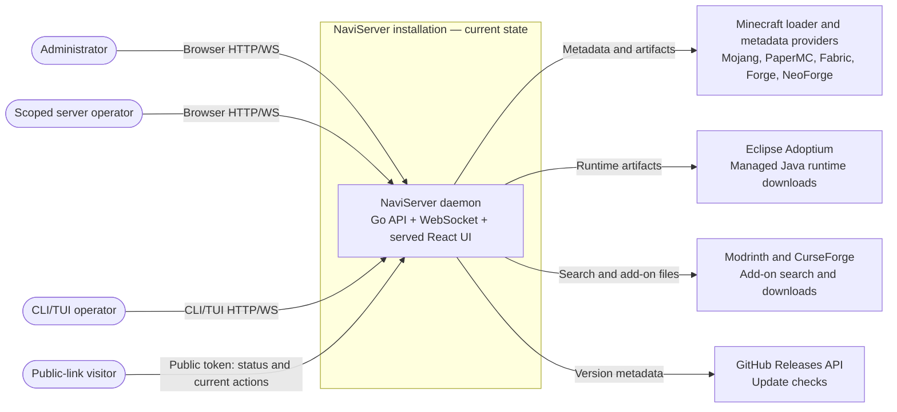

# Architecture

## Status and scope

**Current-state architecture, OBSERVED** from the source at revision `d65df2d`, Docker/build configuration, README, and wiki. Current architecture is not a target redesign; owner-approved behavior and implementation gaps are explicitly separated below. The product owner confirmed the target is personal and small self-hosted use; no multi-node or high-availability requirement was stated. No ADR history was found in the inspected repository.

## C4 system context — current implementation

The system boundary is one NaviServer installation. The browser bundle is served by its daemon; the CLI/TUI is a separate client using that same daemon. Local persistence and child Minecraft processes belong to the installation and are intentionally described in prose rather than shown as third-party systems in this context view.

The diagram describes integration purposes, not provider availability guarantees. Public links are bearer-token access. Direct HTTP is supported for local use. The owner confirmed deployment on trusted networks (LAN or VPN); public bearer links do not imply direct Internet exposure.

## Architecture summary

**INFERRED, high confidence:** NaviServer is a single-process Go modular monolith with capability-oriented packages and a layered request/manager/storage shape. It is not currently strict Clean/Hexagonal architecture: managers and handlers use the concrete `*storage.GormStore`; repository interfaces exist in `internal/domain/repository.go` but are not wired as production dependencies in the inspected flow. There is no evidence of independently deployed backend microservices.

### Major building blocks

| Building block | Responsibility | State/ownership | Evidence |
|---|---|---|---|
| `cmd/server` | Composition root, desktop tray/headless modes, configuration, manager wiring, HTTP start and shutdown. | Owns service lifecycle. | [`main.go`](../../cmd/server/main.go) |
| `internal/api` and handlers | `net/http.ServeMux`, authentication/authorization, REST endpoints, WebSocket upgrades, CORS, and static SPA fallback. | Request boundary; delegates to managers/storage. | [`router.go`](../../internal/api/router.go), [`middleware.go`](../../internal/api/middleware.go) |
| `web` | React/TypeScript/Vite browser interface for dashboard, server details, backups, settings, users, and public links. | Static build output served by daemon; not a separate deployed frontend service. | [`App.tsx`](../../web/src/App.tsx), [`web/package.json`](../../web/package.json) |
| `internal/server`, `internal/loader`, `internal/jvm` | Server-instance creation/settings/files, loader selection/install, Java version selection and download. | Server directories plus persisted instance metadata. | `internal/server`, `internal/loader`, `internal/jvm` |
| `internal/runner` and `internal/ws` | Spawn/control child Minecraft processes, collect output/stats, relay console/progress, coordinate graceful shutdown. | Child processes and in-memory supervisor/hub state. | [`supervisor.go`](../../internal/runner/supervisor.go), `internal/ws` |
| `internal/backup`, `internal/addons`, `internal/upload` | Backup/retention/restore, Modrinth/CurseForge integration, chunked upload lifecycle. | Local archive/server files; upload/progress state managed by daemon. | `internal/backup`, `internal/addons`, `internal/upload` |
| `internal/storage` | GORM-backed SQLite connection, schema auto-migration, application records/settings. | Database file under configured path. | [`gorm.go`](../../internal/storage/gorm.go) |
| `cmd/cli`, `internal/cli`, `pkg/sdk` | Cobra CLI and Bubble Tea TUI using the daemon's HTTP/WebSocket API. | Client-only; does not own the database. | `cmd/cli`, `internal/cli`, `pkg/sdk` |

The loader factory selects installer implementations; the runner strategy selects launch commands. These are local extension points, not separate services.

## Data and state ownership

| Data/state | Current owner and location | Notes |
|---|---|---|
| Server records, settings, users, permissions, public-link records, backup metadata | SQLite via `internal/storage.GormStore`; default file `manager.db` under the app config directory. | GORM `AutoMigrate` runs at store initialization. |
| Minecraft instance files, server properties, icons, add-ons | Per-instance directories under configured `servers_path`. | Creation allocates a port and creates the local directory before saving instance metadata. |
| Backup archives | Configured `backups_path`. | The in-product backup feature concerns Minecraft instances; protect the whole app data root separately. |
| Managed Java runtimes | Configured `runtimes_path`. | Downloaded when required by a server operation. |
| Active child-process handles, WebSocket subscribers, upload jobs/progress | Daemon memory and local temporary files where needed. | No replicated job/process state was found. On startup the supervisor reconciles persisted status rather than restoring child processes. |
| Configuration and secrets | `config.json`, generated secret/token files or environment overrides. | See [configuration guide](../../wiki/configuration.md). |

## Trust and integration boundaries

- Web authentication uses JWT-backed cookies; the API also accepts the CLI token. Middleware maps the CLI token to an administrator identity. Passwords are stored as bcrypt hashes.
- HTTP administrator-only routes and handler-specific permission checks are enforced at the API boundary; UI visibility is not the security boundary. WebSocket routes authenticate but the inspected handler lacks per-server/job permission checks; see [contracts](contracts.md#websocket-contract).
- `NAVISERVER_TRUST_PROXY` controls whether `X-Forwarded-Proto` affects secure-cookie handling; it defaults off. The app's HTTP server does not itself configure a TLS listener.
- A public link is a bearer capability. Owner-approved policy is disabled by default, explicitly enabled by the server administrator, then status and start/stop access for anyone holding the token. Current creation uses `action=control`; link handlers permit `CanViewConsole`, matching the owner-confirmed enabling role (admin or scoped console user).
- Core server creation, Java management, add-on discovery/download, and update checks depend on external HTTP providers. Provider failure can block the related operation; no offline catalog/service mode was found.
- Uploaded/downloaded server and backup data are written to local paths owned by NaviServer; remote object storage was not found.

## Runtime and deployment shape

Native desktop and headless modes run the Go daemon; the daemon can open the browser UI in desktop mode. The Docker image runs headless, uses a non-root user, sets `/data` as its home/config root, serves HTTP on port `23008`, and declares a persistent `/data` volume and health check. Minecraft ports are separate and must also be published by the operator. Native installers and Docker Compose procedures remain canonical in the [installation guide](../../wiki/installation.md).

The observed shape is one daemon with local SQLite/files and locally supervised game processes. No clustering, replicated database, failover, or horizontal scaling mechanism was found. This is an implementation observation, not an approved product ceiling.

## Decisions, risks, and revisit triggers

No ADRs were found. Owner-approved policies and source observations are distinguished below; documentation approval does not imply code implementation:

| Topic | Current fact / risk | Revisit when |
|---|---|---|
| Persistence and recovery | SQLite plus local files; container data is on `/data`. A backup of Minecraft instances is not a full backup of DB/config/secrets. No RPO/RTO is documented. | User needs quantified restore guarantees, off-host copies, or storage migration. |
| Public access | Owner-approved: disabled by default, explicit activation grants bearer status/start/stop access. Verify enable/revoke enforcement. | Public sharing is exposed beyond a trusted community or capability separation is requested. |
| Permission boundary | Owner confirms console permission includes start/stop; current code also permits restart/kill. | A use case requires read-only console/files access or least-privilege separation. |
| EULA workflow | Current creation writes `eula=true`; owner requires explicit first-start modal when EULA is false. This is an accepted target with an implementation gap (RF-011). | Implement creation defaults, backend start gating and browser consent together; public-link/CLI must refuse pending consent; TUI offers acceptance while available. |
| Scale and availability | Product target is small self-hosted use; no limits, SLO, or HA objectives are stated. | Measured concurrency, availability, or recovery needs exceed the single-host process model. |
| Testability boundary | Core managers depend on concrete GORM storage despite repository interfaces. | Tests or alternate persistence adapters become a current need; do not refactor solely to match a pattern. |

## Evidence limits

This page was prepared from a static source/documentation review at `d65df2d`. External providers, installed native packages, live deployments, actual release artifacts, restore behavior on a real installation, and test results were not exercised. The repository contains [`repository.go`](../../internal/domain/repository.go), but finding interfaces is not evidence that all dependencies are abstracted.

## Detailed maintainer references

- [HTTP, WebSocket, DTO and persistence contracts](contracts.md) — registered routes, wire formats, role boundaries and source-level mismatches.
- [Development guide](../04-quality-operations/development.md) — two-process dev mode, data isolation, builds and extension points.

The TUI is currently implemented; the owner intends to discontinue it without a removal date/version. CLI remains a separate supported administration path. WebSocket middleware authentication does not imply per-server/job authorization: the current handler lacks those checks; see the contract reference before making broader security claims.
